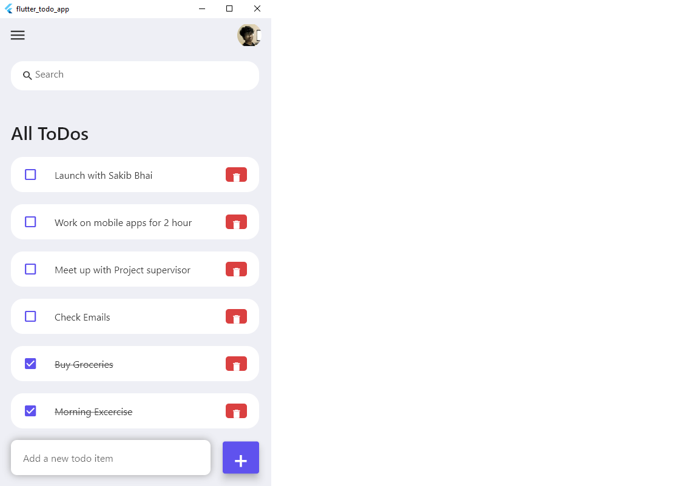

# Flutter ToDo App
A ToDo mobile application built using Flutter.

An easy-to-use to-do app developed with Flutter, featuring task creation, deletion, and modification, along with a search function for finding any task. This tiny project is part of My academic CSE278 course. At the same, I'm trying to get familiar with cross-platform mobile app development.

## Screenshot

# Future work

Task Management: The app should provide a user-friendly interface to create, organize, prioritize, and categorize tasks. It should allow users to easily add, edit, and delete tasks as needed.

Reminders and Notifications: The app should have a reminder system that allows users to set due dates, deadlines, and reminders for their tasks. This feature ensures that users stay on top of their responsibilities and receive timely notifications.

Task Prioritization: Users should be able to prioritize tasks based on their importance or urgency. This feature helps individuals focus on high-priority tasks and ensures that critical deadlines are met.

Progress Tracking and Completion Visualization: The app should provide visual indicators, such as progress bars or checkmarks, to track task completion. This feature allows users to see their progress at a glance and stay motivated.
